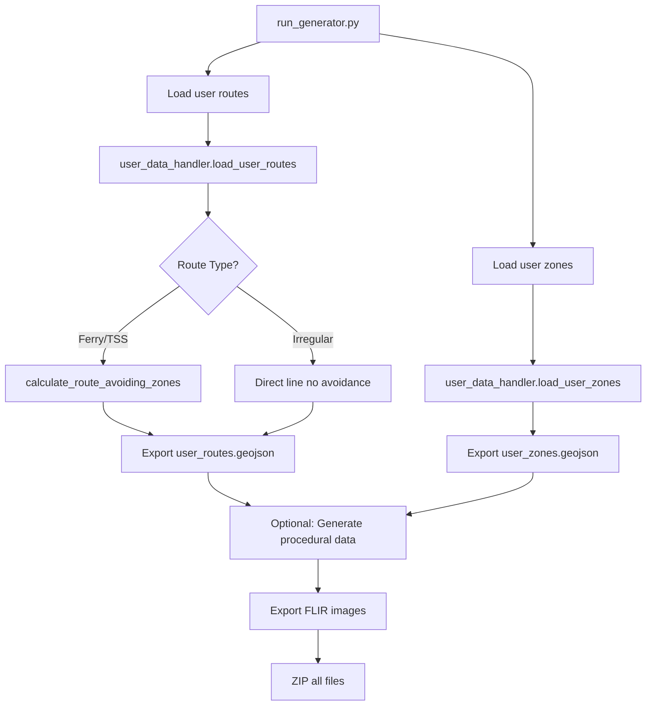

# Maritime Generator

A Python module for generating 100% fictitious maritime data for the Thales Fictitious Map Generator. Supports both **user-defined** zones/routes and **procedural generation**.

## 🎯 Overview

This generator creates:
- **User-defined no-go zones** (drawn on map by user)
- **User-defined vessel routes** (start/end pins placed by user)
- **Optional procedural zones** (MPA, military, windfarm)
- **Optional procedural routes** (ferry, TSS, irregular)
- **FLIR thermal images** of vessels
- **GeoJSON outputs** compatible with QGIS

All data is **100% fictitious** and uses WGS84 (EPSG:4326).

---

## 📁 File Structure

### Core Files

| File | Purpose |
|------|---------|
| `run_generator.py` | **Main entry point** - Called by Next.js API, orchestrates generation |
| `generator.py` | **Procedural generation** - Creates random zones and routes |
| `user_data_handler.py` | **User data handler** - Processes user-drawn zones/routes, obstacle avoidance |
| `geometry.py` | **Shape utilities** - Creates polygons, validates geometries |
| `io.py` | **GeoJSON exporter** - Writes zones/routes to `.geojson` files |
| `utils.py` | **Helper functions** - Distance calculations, random utilities |
| `flir.py` | **FLIR generator** - Creates thermal vessel images |
| `route_planner.py` | **Pathfinding** - A* algorithm for obstacle avoidance (optional) |

### Unused Files (Can Delete)

| File | Reason |
|------|--------|
| `example_usage.py` | Development example only |
| `test_validation.py` | Testing script (not called by API) |
| `README.md` | This file (documentation) |

---

## 🔄 Workflow

### 1. **User Interaction (Frontend)**
```
User draws zones → Places route pins → Clicks "Generate Maritime Data"
```

### 2. **API Call** (`/api/generate-maritime`)
```typescript
// Next.js API parses user data
const noGoZones = JSON.parse(searchParams.get("noGoZones"));
const userRoutes = JSON.parse(searchParams.get("userRoutes"));
```

### 3. **Python Execution**
```bash
python run_generator.py --bbox bbox.json --config config.json --output /tmp/...
```

### 4. **Processing Pipeline**



---

## 🚦 User-Defined Data Flow

### No-Go Zones

**Input** (from frontend):
```json
{
  "user_no_go_zones": [
    {
      "id": "zone-uuid",
      "name": "User No-Go Zone 1",
      "coordinates": [
        [148.0, -37.8],
        [148.05, -37.8],
        [148.05, -37.75],
        [148.0, -37.75],
        [148.0, -37.8]
      ]
    }
  ]
}
```

**Processing** (`user_data_handler.py`):
1. Parse coordinates into Shapely `Polygon`
2. Validate geometry
3. Export as GeoJSON

**Output** (`user_zones.geojson`):
```json
{
  "type": "FeatureCollection",
  "features": [
    {
      "type": "Feature",
      "properties": {
        "id": "zone-uuid",
        "name": "User No-Go Zone 1",
        "type": "user_defined",
        "restriction": "no-go"
      },
      "geometry": {
        "type": "Polygon",
        "coordinates": [[...]]
      }
    }
  ]
}
```

### Vessel Routes

**Input** (from frontend):
```json
{
  "user_routes": [
    {
      "id": "route-uuid",
      "name": "Ferry Route 1",
      "start": {"lon": 148.0, "lat": -37.8},
      "end": {"lon": 148.1, "lat": -37.7},
      "type": "ferry"
    }
  ]
}
```

**Processing** (`user_data_handler.py`):
1. Extract start/end coordinates
2. **If ferry/tss**: Calculate waypoints avoiding no-go zones
3. **If irregular**: Use direct line (no avoidance)
4. Export as GeoJSON with `LineString`

**Output** (`user_routes.geojson`):
```json
{
  "type": "FeatureCollection",
  "features": [
    {
      "type": "Feature",
      "properties": {
        "id": "route-uuid",
        "name": "Ferry Route 1",
        "type": "ferry",
        "vessel_type": "ferry",
        "suspicious": false,
        "waypoints": 3
      },
      "geometry": {
        "type": "LineString",
        "coordinates": [
          [148.0, -37.8],
          [148.05, -37.75],  // Waypoint avoiding obstacle
          [148.1, -37.7]
        ]
      }
    }
  ]
}
```

---

## 🛠️ Installation

```bash
cd maritime_generator
pip install numpy shapely geopandas pillow
```

### Dependencies

- **`numpy`**: Numerical operations
- **`shapely`**: Geometry manipulation, obstacle detection
- **`geopandas`**: GeoJSON I/O (optional, can use `json` instead)
- **`PIL (Pillow)`**: FLIR image generation

---

## 🧪 Testing Locally

### Generate Test Data

```bash
# Create test config
cat > test_config.json <<EOF
{
  "user_no_go_zones": [
    {
      "id": "test-zone",
      "name": "Test Zone",
      "coordinates": [[148.0, -37.8], [148.05, -37.8], [148.05, -37.75], [148.0, -37.75], [148.0, -37.8]]
    }
  ],
  "user_routes": [
    {
      "id": "test-route",
      "name": "Test Ferry",
      "start": {"lon": 148.0, "lat": -37.9},
      "end": {"lon": 148.1, "lat": -37.6},
      "type": "ferry"
    }
  ],
  "num_routes": 0,
  "num_zones": {"mpa": 0, "military": 0, "windfarm": 0},
  "flir_frames": 10,
  "vessel_speed_kts": 18.0,
  "random_seed": 42
}
EOF

# Create bbox
cat > test_bbox.json <<EOF
{
  "min_lon": 148.0,
  "min_lat": -37.9,
  "max_lon": 148.1,
  "max_lat": -37.6
}
EOF

# Run generator
python run_generator.py --bbox test_bbox.json --config test_config.json --output ./test_output

# Check output
ls -lah test_output/maritime/
```

---

## 📊 Output Structure

```
output/maritime/
├── user_zones.geojson       # User-drawn no-go zones
├── user_routes.geojson      # User-placed routes (with obstacle avoidance)
├── procedural_zones.geojson # Optional: Auto-generated zones
├── procedural_routes.geojson# Optional: Auto-generated routes
└── flir/
    ├── frame_0001.png       # Thermal vessel images
    ├── frame_0002.png
    └── ...
```

---

## 🚢 Route Types & Obstacle Avoidance

### Ferry Routes (`type: "ferry"`)
- ✅ **Avoids no-go zones**
- Uses waypoint calculation
- Smooth, realistic paths

### TSS Routes (`type: "tss"`)
- ✅ **Avoids no-go zones**
- Traffic Separation Scheme
- Structured shipping lanes

### Irregular Routes (`type: "irregular"`)
- ❌ **Does NOT avoid zones**
- Direct line start → end
- Represents suspicious vessels

---

## 🔧 Configuration Options

### User-Defined (Required)

```json
{
  "user_no_go_zones": [...],  // Array of zone polygons
  "user_routes": [...]        // Array of route start/end points
}
```

### Procedural (Optional)

```json
{
  "num_routes": 5,                           // Number of random routes
  "route_type": ["ferry", "tss", "irregular"], // Route types
  "num_zones": {
    "mpa": 2,       // Marine Protected Areas
    "military": 1,  // Military zones
    "windfarm": 1   // Windfarm zones
  },
  "flir_frames": 20,        // Number of FLIR images
  "vessel_speed_kts": 18.0, // Vessel speed
  "multi_vessel": true,     // Multiple vessels on same route
  "random_seed": 42         // Reproducibility
}
```

---

## 🎨 FLIR Image Generation

### Features
- **256×256 or 512×512 pixels**
- Thermal colormap (white/yellow = hot, black/blue = cool)
- Gaussian blur for realism
- Random noise
- Vessel silhouette consistent across frames

### Example Output
```
flir/frame_0001.png  →  [Thermal image of vessel at position 1]
flir/frame_0002.png  →  [Thermal image of vessel at position 2]
...
```

---

## ✅ Validation

All generated data is:
- ✅ **Valid GeoJSON** (loads in QGIS)
- ✅ **Correct CRS** (EPSG:4326 - WGS84)
- ✅ **100% fictitious** (no real maritime data)
- ✅ **Within bounding box**
- ✅ **Valid geometries** (Shapely validation)

---

## 🐛 Troubleshooting

### Issue: Routes intersect no-go zones

**Cause**: Obstacle avoidance failed  
**Fix**: Check `calculate_route_avoiding_zones()` in `user_data_handler.py`

### Issue: Invalid polygon error

**Cause**: User drew self-intersecting polygon  
**Fix**: Add `poly.buffer(0)` to fix topology

### Issue: FLIR images blank

**Cause**: Missing Pillow library  
**Fix**: `pip install pillow`

---

## 🔗 Integration with Next.js

The generator is called by the Next.js API route:

```typescript
// /api/generate-maritime/route.ts
const pythonProcess = spawn('python3', [
  'maritime_generator/run_generator.py',
  '--bbox', bboxPath,
  '--config', configPath,
  '--output', outputDir
]);
```

---

## 📝 License

Part of the Thales Fictitious Map Generator toolkit.

---

## 👥 Contributors

- Maritime generation logic
- User-defined data handling
- FLIR thermal imaging
- GeoJSON export utilities


